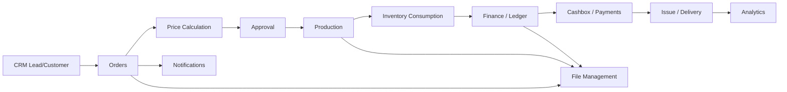

# ERP / MIS для типографии полного цикла

## Phase 1. Полная архитектура проекта

### Архитектурный подход

| Слой | Ответственность | Примеры |
|---|---|---|
| Presentation | HTTP API, WebSocket, DTO, Guards, Validation | NestJS Controllers, interceptors, pipes |
| Application | Use-cases, orchestration, workflows, transactions | CreateOrder, ApprovePrice, ReserveMaterials |
| Domain | Entities, value objects, business rules, policies | Order, ProductionJob, StockReservation |
| Infrastructure | DB, cache, queue, file storage, Telegram, PDF, external adapters | PostgreSQL, S3, Telegram Bot, Redis |
| Read Models | Аналитика, dashboards, отчеты | materialized views, reporting tables |

### Ключевые принципы

| Принцип | Решение |
|---|---|
| Главный агрегат | `Order` является ядром всей системы |
| Масштабирование | Modular monolith с жесткими bounded contexts |
| Будущие микросервисы | Domain events + outbox pattern + изолированные модули |
| Финансы | Двойная запись и раздельный учет денег, долгов и прибыли |
| Склад | Резервирование, списание, возвраты, движение по складам |
| Аудит | Полный audit trail по всем критичным действиям |
| История | Activity history и versioning для ключевых сущностей |
| Безопасность | JWT + RBAC + granular permissions |
| Мультиплатформа | Responsive web + PWA + mobile-first layouts |
| Интеграции | Telegram, PDF, future AI, email, scanners, payment gateways |

### High-level flow



### Bounded contexts

| Context | Что делает |
|---|---|
| Identity & Access | Пользователи, роли, permissions, JWT, sessions |
| CRM | Клиенты, лиды, контакты, коммуникации, история |
| Orders | Заказы, позиции, статусы, согласование, документы |
| Pricing | Себестоимость, прайс-правила, калькуляция маржи |
| Production | Производственные задания, этапы, маршруты, мощности |
| Inventory | Материалы, остатки, резервы, списания, возвраты |
| Purchases | Закупки, поставщики, приход материалов |
| Finance | Счета, проводки, платежи, прибыль, debt accounting |
| Cashbox | Кассы, смены, приход/расход, закрытие дня |
| Debts | Дебиторка, кредиторка, графики погашения |
| Salary | Зарплаты, начисления, удержания, закрытие периода |
| Analytics | KPI, profitability, throughput, WIP, dashboards |
| Notifications | Telegram, in-app, email-ready event notifications |
| Files | PDF, scans, design files, print-ready assets |
| Audit | Who did what, when, from where, old/new values |

---

## Phase 1. Структура папок

### Монорепозиторий

```txt
bestapp/
  apps/
    backend/
      src/
        main.ts
        app.module.ts
        common/
        modules/
        config/
        database/
        auth/
        users/
        roles/
        crm/
        orders/
        pricing/
        production/
        inventory/
        purchases/
        finance/
        cashbox/
        debts/
        salary/
        analytics/
        notifications/
        files/
        audit/
        integrations/
        reports/
      test/
    frontend/
      src/
        app/
        pages/
        widgets/
        features/
        entities/
        shared/
        routes/
        styles/
        assets/
      public/
  packages/
    shared/
      src/
        types/
        constants/
        enums/
        validators/
        utils/
    ui/
      src/
        components/
        forms/
        layout/
        charts/
        tables/
    config/
      eslint/
      tsconfig/
      tailwind/
  infra/
    docker/
    postgres/
    nginx/
    scripts/
  docs/
    architecture/
    db/
    api/
    workflows/
  .github/
  docker-compose.yml
  package.json
  pnpm-workspace.yaml
  turbo.json
```

### Backend folder philosophy

| Folder | Назначение |
|---|---|
| `common` | guards, interceptors, pipes, exceptions, helpers |
| `modules` | бизнес-модули по bounded context |
| `config` | env, feature flags, validation, app settings |
| `database` | migrations, seeds, db connection, transaction helpers |
| `integrations` | Telegram, PDF, storage, queue, future ERP connectors |
| `reports` | read models, exports, aggregated views |

### Frontend folder philosophy

| Folder | Назначение |
|---|---|
| `app` | bootstrapping, providers, global layout, routes |
| `pages` | screens уровня маршрута |
| `widgets` | крупные композиционные блоки |
| `features` | бизнес-функции: create order, pay invoice, reserve stock |
| `entities` | domain entities in UI form |
| `shared` | UI kit, hooks, utils, api client, tokens |
| `styles` | Tailwind layers, variables, theming |

---

## Phase 1. Database schema

### Core tables

| Домейн | Таблицы |
|---|---|
| Identity & Access | `users`, `roles`, `permissions`, `user_roles`, `role_permissions`, `sessions`, `refresh_tokens` |
| CRM | `customers`, `customer_contacts`, `customer_addresses`, `customer_interactions`, `customer_notes`, `leads` |
| Orders | `orders`, `order_items`, `order_status_history`, `order_documents`, `order_comments`, `order_price_versions` |
| Pricing | `price_rules`, `price_rule_conditions`, `cost_calculations`, `cost_calculation_lines`, `markup_rules` |
| Production | `production_jobs`, `production_routes`, `production_operations`, `production_operation_logs`, `work_centers`, `machines` |
| Inventory | `materials`, `material_categories`, `warehouses`, `stock_levels`, `stock_movements`, `stock_reservations`, `stock_adjustments` |
| Purchases | `suppliers`, `purchase_orders`, `purchase_order_items`, `goods_receipts`, `purchase_invoices` |
| Finance | `accounts`, `journal_entries`, `journal_lines`, `invoices`, `invoice_items`, `payments`, `payment_allocations` |
| Cashbox | `cashboxes`, `cashbox_shifts`, `cashbox_transactions`, `cashbox_closings` |
| Debts | `receivables`, `payables`, `debt_schedules`, `debt_payments`, `debt_history` |
| Salary | `employees`, `salary_periods`, `salary_rules`, `salary_accruals`, `salary_payments`, `salary_deductions` |
| Analytics | `kpi_snapshots`, `daily_dashboard_stats`, `production_metrics`, `financial_metrics` |
| Notifications | `notifications`, `notification_templates`, `notification_deliveries`, `telegram_accounts` |
| Files | `files`, `file_versions`, `file_links`, `file_tags` |
| Audit | `audit_logs`, `activity_logs`, `entity_histories`, `outbox_events` |
| Settings | `app_settings`, `number_sequences`, `reference_values` |

### Support tables

| Домейн | Таблицы |
|---|---|
| Production catalog | `service_catalog`, `operation_templates`, `route_templates`, `machine_capacity_rules` |
| Document generation | `document_templates`, `pdf_jobs`, `print_batches` |
| Approval flow | `approvals`, `approval_steps`, `approval_history` |
| Multi-warehouse | `warehouse_locations`, `bin_locations` |
| Quality control | `quality_checks`, `quality_defects`, `rework_orders` |

### Database design notes

| Объект | Решение |
|---|---|
| UUID | Использовать UUID или ULID как primary keys |
| Soft delete | `deleted_at`, `deleted_by` почти везде |
| History | Отдельные audit/history tables для критичных сущностей |
| Money | `numeric(18,2)` или `numeric(18,4)` для unit cost |
| Quantities | `numeric(18,4)` для материалов и норм |
| Statuses | Enum + status history, не только строковое поле |
| Currency | `currency_code`, если возможна мультивалюта |
| Costing | Хранить расчет себестоимости версионно |
| Inventory | Вести движения, а не просто остаток |
| Finance | Вести проводки, а не только суммы |

---

## Phase 1. Список таблиц

| № | Таблица | Назначение |
|---|---|---|
| 1 | `users` | Пользователи системы |
| 2 | `roles` | Роли доступа |
| 3 | `permissions` | Гранулярные права |
| 4 | `user_roles` | Связь user-role |
| 5 | `role_permissions` | Связь role-permission |
| 6 | `sessions` | Активные сессии |
| 7 | `refresh_tokens` | Refresh token storage |
| 8 | `customers` | Клиенты |
| 9 | `customer_contacts` | Контакты клиента |
| 10 | `customer_addresses` | Адреса клиента |
| 11 | `customer_interactions` | Коммуникации |
| 12 | `customer_notes` | Заметки |
| 13 | `leads` | Лиды |
| 14 | `orders` | Заказы |
| 15 | `order_items` | Позиции заказа |
| 16 | `order_status_history` | История статусов |
| 17 | `order_documents` | Документы заказа |
| 18 | `order_comments` | Комментарии |
| 19 | `order_price_versions` | Версии расчета цены |
| 20 | `price_rules` | Правила ценообразования |
| 21 | `price_rule_conditions` | Условия правил |
| 22 | `cost_calculations` | Расчет себестоимости |
| 23 | `cost_calculation_lines` | Строки калькуляции |
| 24 | `markup_rules` | Правила наценки |
| 25 | `production_jobs` | Производственные задания |
| 26 | `production_routes` | Маршруты производства |
| 27 | `production_operations` | Операции производства |
| 28 | `production_operation_logs` | Логи выполнения |
| 29 | `work_centers` | Участки и цеха |
| 30 | `machines` | Оборудование |
| 31 | `service_catalog` | Каталог услуг |
| 32 | `operation_templates` | Шаблоны операций |
| 33 | `route_templates` | Шаблоны маршрутов |
| 34 | `materials` | Материалы |
| 35 | `material_categories` | Категории материалов |
| 36 | `warehouses` | Склады |
| 37 | `warehouse_locations` | Ячейки |
| 38 | `stock_levels` | Текущие остатки |
| 39 | `stock_movements` | Движения склада |
| 40 | `stock_reservations` | Резервы под заказы |
| 41 | `stock_adjustments` | Корректировки |
| 42 | `suppliers` | Поставщики |
| 43 | `purchase_orders` | Заказы поставщикам |
| 44 | `purchase_order_items` | Строки закупки |
| 45 | `goods_receipts` | Приход материалов |
| 46 | `purchase_invoices` | Счета от поставщиков |
| 47 | `accounts` | План счетов |
| 48 | `journal_entries` | Проводки |
| 49 | `journal_lines` | Строки проводок |
| 50 | `invoices` | Счета клиентам |
| 51 | `invoice_items` | Строки счетов |
| 52 | `payments` | Платежи |
| 53 | `payment_allocations` | Распределение платежей |
| 54 | `cashboxes` | Кассы |
| 55 | `cashbox_shifts` | Кассовые смены |
| 56 | `cashbox_transactions` | Кассовые операции |
| 57 | `cashbox_closings` | Закрытие смены |
| 58 | `receivables` | Дебиторка |
| 59 | `payables` | Кредиторка |
| 60 | `debt_schedules` | Графики долгов |
| 61 | `debt_payments` | Погашения |
| 62 | `debt_history` | История долгов |
| 63 | `employees` | Сотрудники |
| 64 | `salary_periods` | Периоды зарплаты |
| 65 | `salary_rules` | Правила начислений |
| 66 | `salary_accruals` | Начисления |
| 67 | `salary_payments` | Выплаты |
| 68 | `salary_deductions` | Удержания |
| 69 | `kpi_snapshots` | KPI-снимки |
| 70 | `daily_dashboard_stats` | Daily dashboard aggregates |
| 71 | `production_metrics` | Метрики производства |
| 72 | `financial_metrics` | Финансовые метрики |
| 73 | `notifications` | Уведомления |
| 74 | `notification_templates` | Шаблоны |
| 75 | `notification_deliveries` | История доставки |
| 76 | `telegram_accounts` | Telegram bindings |
| 77 | `files` | Файлы |
| 78 | `file_versions` | Версии файлов |
| 79 | `file_links` | Привязки файлов к сущностям |
| 80 | `file_tags` | Теги файлов |
| 81 | `audit_logs` | Audit trail |
| 82 | `activity_logs` | Activity feed |
| 83 | `entity_histories` | Снапшоты изменений |
| 84 | `outbox_events` | Outbox для интеграций |
| 85 | `app_settings` | Настройки приложения |
| 86 | `number_sequences` | Нумерация документов |
| 87 | `reference_values` | Справочные значения |
| 88 | `approvals` | Согласования |
| 89 | `approval_steps` | Шаги согласования |
| 90 | `approval_history` | История согласования |
| 91 | `quality_checks` | Контроль качества |
| 92 | `quality_defects` | Дефекты |
| 93 | `rework_orders` | Переделки |
| 94 | `pdf_jobs` | Генерация PDF |
| 95 | `document_templates` | Шаблоны документов |
| 96 | `print_batches` | Печатные партии |

---

## Phase 1. Relationships

### Entity relationship diagram

```mermaid
erDiagram
  users ||--o{ user_roles : has
  roles ||--o{ user_roles : contains
  roles ||--o{ role_permissions : grants
  permissions ||--o{ role_permissions : mapped

  customers ||--o{ customer_contacts : has
  customers ||--o{ customer_addresses : has
  customers ||--o{ orders : places
  customers ||--o{ leads : owns
  customers ||--o{ customer_interactions : history

  orders ||--o{ order_items : contains
  orders ||--o{ order_status_history : tracks
  orders ||--o{ order_documents : has
  orders ||--o{ order_price_versions : priced_by
  orders ||--o{ production_jobs : triggers
  orders ||--o{ invoices : billed_by
  orders ||--o{ payments : paid_by
  orders ||--o{ stock_reservations : reserves

  production_jobs ||--o{ production_operations : includes
  production_jobs ||--o{ production_operation_logs : logs
  production_jobs ||--o{ stock_movements : consumes
  production_jobs ||--o{ quality_checks : inspected_by
  production_jobs ||--o{ rework_orders : may_create

  warehouses ||--o{ stock_levels : stores
  materials ||--o{ stock_levels : tracked_as
  materials ||--o{ stock_movements : moved_as
  materials ||--o{ stock_reservations : reserved_as
  suppliers ||--o{ purchase_orders : receives

  purchase_orders ||--o{ purchase_order_items : contains
  purchase_orders ||--o{ goods_receipts : fulfilled_by
  purchase_orders ||--o{ purchase_invoices : invoiced_by

  invoices ||--o{ invoice_items : contains
  invoices ||--o{ payment_allocations : allocated_to
  payments ||--o{ payment_allocations : distributed_by

  cashboxes ||--o{ cashbox_shifts : has
  cashbox_shifts ||--o{ cashbox_transactions : records
  cashbox_shifts ||--o{ cashbox_closings : closes

  accounts ||--o{ journal_lines : referenced_by
  journal_entries ||--o{ journal_lines : contains
  orders ||--o{ journal_entries : origin

  employees ||--o{ salary_accruals : earns
  salary_periods ||--o{ salary_accruals : includes
  salary_periods ||--o{ salary_payments : paid_in

  files ||--o{ file_versions : versions
  files ||--o{ file_links : linked_to
  users ||--o{ audit_logs : performs
  users ||--o{ activity_logs : generates
  users ||--o{ notifications : receives
  orders ||--o{ outbox_events : emits
```



### Key cardinalities

| Relationship | Тип |
|---|---|
| Customer -> Orders | 1:N |
| Order -> OrderItems | 1:N |
| Order -> ProductionJobs | 1:N |
| ProductionJob -> ProductionOperations | 1:N |
| ProductionJob -> StockMovements | 1:N |
| Material -> StockLevels | 1:N |
| Warehouse -> StockLevels | 1:N |
| PurchaseOrder -> PurchaseOrderItems | 1:N |
| Invoice -> Payments | M:N через `payment_allocations` |
| CashboxShift -> CashboxTransactions | 1:N |
| JournalEntry -> JournalLines | 1:N |
| User -> Roles | M:N через `user_roles` |
| Role -> Permissions | M:N через `role_permissions` |
| Order -> Audit/History | 1:N |
| File -> Entity Links | 1:N |

---

## Phase 1. Backend modules

### Modules for NestJS

| Модуль | Ответственность |
|---|---|
| `auth` | Login, refresh, JWT, guards, token rotation |
| `users` | Пользователи, profile, internal staff data |
| `roles` | RBAC, permissions matrix, policy checks |
| `crm` | Leads, customers, contacts, interactions |
| `orders` | Order lifecycle, items, approval, docs |
| `pricing` | Costing engine, margin, quote revisions |
| `production` | Jobs, routes, operations, capacity, QC |
| `inventory` | Stock, reservations, write-off, movements |
| `purchases` | Suppliers, PO, receipts, procurement |
| `finance` | Invoices, journal entries, payment logic |
| `cashbox` | Shifts, cash movement, closing, reconciliation |
| `debts` | AR/AP, schedules, aging, collections |
| `salary` | Payroll, accruals, deductions, payments |
| `analytics` | Aggregations, dashboards, KPI snapshots |
| `notifications` | Telegram, in-app, templates, delivery |
| `files` | Upload, versioning, PDF, attachment links |
| `audit` | Audit logs, activity stream, entity snapshots |
| `integrations` | Telegram, external gateways, webhooks |
| `reports` | Exports, print-ready docs, PDF batches |
| `catalogs` | Reference data, service/material catalogs |
| `settings` | Global configs, numbering, feature flags |

### Internal module structure

| Layer | Содержимое |
|---|---|
| `domain` | entities, value objects, policies, domain events |
| `application` | use-cases, command handlers, query handlers |
| `infrastructure` | repositories, mappers, adapters |
| `presentation` | controllers, dto, swagger schema |

### Aggregate roots

| Module | Aggregate roots |
|---|---|
| Orders | `Order` |
| Production | `ProductionJob` |
| Inventory | `StockItem`, `StockReservation`, `StockMovement` |
| Finance | `Invoice`, `Payment`, `JournalEntry` |
| Cashbox | `CashboxShift` |
| Debts | `Receivable`, `Payable` |
| Salary | `SalaryPeriod` |
| CRM | `Customer`, `Lead` |

---

## Phase 1. Production workflow

### Order lifecycle

| Stage | Что происходит |
|---|---|
| Creation | Создается заказ, клиент, позиции, вложения |
| Price calculation | Автоматический расчет себестоимости и цены |
| Production | Создается производственное задание и маршрут |
| Material write-off | Резерв и списание материалов |
| Payment | Частичная или полная оплата |
| Issue | Выдача клиенту, закрытие финансового цикла |
| Analytics | KPI, margin, throughput, debt, WIP |

### Production workflow

| Шаг | Суть |
|---|---|
| 1 | Выбор технологического маршрута |
| 2 | Разбиение заказа на операции |
| 3 | Планирование участков и ресурсов |
| 4 | Резервирование материалов |
| 5 | Запуск операции |
| 6 | Фиксация факта выполнения |
| 7 | Контроль качества |
| 8 | Передача на следующий этап |
| 9 | Завершение и закрытие job |

### Supported production types

| Тип | Примеры |
|---|---|
| Офсетная печать | large run jobs, plates, prep, machine allocation |
| Цифровая печать | short runs, fast turnaround |
| Постпечатка | folding, binding, lamination, stitching |
| Резка | guillotine, contour, trimming |
| Ламинация | matte, gloss, soft touch |
| Биговка | creasing, folding preparation |
| Упаковка | final packaging, dispatch prep |

---

## Phase 1. Financial workflow

### Financial flow

| Шаг | Суть |
|---|---|
| 1 | После расчета создается цена и маржа |
| 2 | При согласовании формируется invoice |
| 3 | При оплате создается payment |
| 4 | Payment распределяется по invoice/debt |
| 5 | Формируются journal entries |
| 6 | Cashbox синхронизируется при наличных |
| 7 | Дебиторка пересчитывается |
| 8 | Profitability попадает в analytics |

### Financial principles

| Принцип | Реализация |
|---|---|
| Двойная запись | `journal_entries` + `journal_lines` |
| Прозрачный cashflow | separate cashbox transactions and allocations |
| Контроль прибыли | order margin, period profit, product profitability |
| Контроль долгов | receivable/payable aging and schedules |
| Частичные платежи | `payment_allocations` |
| Историчность | все денежные операции immutable + audit |

---

## Phase 1. Inventory workflow

### Inventory flow

| Шаг | Суть |
|---|---|
| 1 | Резервирование материалов под заказ |
| 2 | Списание при запуске или завершении операции |
| 3 | Возврат неизрасходованных остатков |
| 4 | Корректировка по инвентаризации |
| 5 | Автоматический low-stock trigger |
| 6 | Создание purchase request |
| 7 | Приход от поставщика |
| 8 | Обновление stock levels и analytics |

### Inventory principles

| Принцип | Реализация |
|---|---|
| Не храним только остаток | Ведем движения |
| Резерв до списания | `stock_reservations` |
| Трассируемость | Каждое движение связано с причиной |
| Возвраты | Отдельный тип движения |
| Инвентаризация | Корректировки и акты |

---

## Phase 1. User roles

### Role model

| Role | Доступ |
|---|---|
| Super Admin | Полный доступ, настройки, безопасность, все отчеты |
| CEO / Owner | Финансы, KPI, прибыль, дебиторка, контроль задач |
| Operations Manager | Производство, загрузка, статус заказов |
| Sales Manager | CRM, заказы, цены, коммуникации |
| Accountant | Платежи, счета, cashbox, debts, finance |
| Warehouse Manager | Остатки, резервы, списания, приходы |
| Production Operator | Свои задания, операции, статусы |
| Designer / Prepress | Файлы, макеты, prepress workflow |
| Cashier | Касса, смены, платежи |
| HR / Payroll | Сотрудники, зарплаты, начисления |
| Client Portal User | Только свои заказы, счета, статусы |
| Auditor | Read-only доступ с audit trail |

---

## Phase 1. API structure

### REST API groups

| Module | Routes |
|---|---|
| Auth | `POST /api/v1/auth/login`, `POST /api/v1/auth/refresh`, `POST /api/v1/auth/logout`, `GET /api/v1/auth/me` |
| Users | `GET/POST/PATCH /api/v1/users` |
| Roles | `GET/POST/PATCH /api/v1/roles`, `GET/POST /api/v1/permissions` |
| CRM | `GET/POST/PATCH /api/v1/customers`, `GET /api/v1/leads`, `POST /api/v1/customers/:id/interactions` |
| Orders | `GET/POST/PATCH /api/v1/orders`, `POST /api/v1/orders/:id/approve`, `POST /api/v1/orders/:id/cancel` |
| Pricing | `POST /api/v1/orders/:id/calculate-price`, `GET /api/v1/orders/:id/cost-history` |
| Production | `POST /api/v1/production/jobs`, `POST /api/v1/production/jobs/:id/start`, `POST /api/v1/production/jobs/:id/finish` |
| Inventory | `GET /api/v1/inventory/stock`, `POST /api/v1/inventory/reserve`, `POST /api/v1/inventory/write-off` |
| Purchases | `GET/POST /api/v1/purchases/orders`, `POST /api/v1/purchases/receipts` |
| Finance | `GET /api/v1/finance/invoices`, `POST /api/v1/finance/payments`, `GET /api/v1/finance/journal` |
| Cashbox | `GET/POST /api/v1/cashbox/shifts`, `POST /api/v1/cashbox/transactions`, `POST /api/v1/cashbox/close` |
| Debts | `GET /api/v1/debts/receivables`, `GET /api/v1/debts/payables`, `POST /api/v1/debts/payments` |
| Salary | `GET/POST /api/v1/salary/periods`, `POST /api/v1/salary/accrue`, `POST /api/v1/salary/pay` |
| Analytics | `GET /api/v1/analytics/dashboard`, `GET /api/v1/analytics/profitability` |
| Notifications | `GET /api/v1/notifications`, `POST /api/v1/notifications/send` |
| Files | `POST /api/v1/files/upload`, `GET /api/v1/files/:id`, `POST /api/v1/files/link` |
| Audit | `GET /api/v1/audit/logs`, `GET /api/v1/activity` |

### API conventions

| Rule | Стандарт |
|---|---|
| Versioning | `/api/v1` |
| Pagination | `page`, `limit`, `sort`, `filter` |
| Filtering | DTO-based query filters |
| Error format | Unified domain error schema |
| Docs | Swagger/OpenAPI auto-generation |
| Idempotency | For payments, stock write-off, job completion |
| Realtime | WebSocket/SSE for production and notifications |

---

## Phase 1. Development roadmap

### Phase 1: Architecture and domain design

| Шаг | Результат |
|---|---|
| 1 | Утверждение bounded contexts и агрегатов |
| 2 | Финализация DB schema и naming conventions |
| 3 | Согласование order lifecycle state machine |
| 4 | Согласование finance model: ledger, cashbox, debts |
| 5 | Согласование inventory model: reserve, issue, write-off, return |
| 6 | API contract and module boundaries |
| 7 | UI architecture and design system skeleton |
| 8 | Infra plan: Docker, environments, migrations, backups |

### Phase 2: Backend foundation

| Шаг | Результат |
|---|---|
| 1 | NestJS monolith scaffold |
| 2 | PostgreSQL schema + migrations |
| 3 | Auth + RBAC + permissions seed |
| 4 | Base entities + repositories + audit |
| 5 | Order core workflow |
| 6 | Production + inventory + finance orchestration |
| 7 | Notification + PDF + file storage adapters |
| 8 | Swagger + validation + error handling |
| 9 | Test foundation: unit, integration, e2e |

### Phase 3: Frontend dashboard and UI system

| Шаг | Результат |
|---|---|
| 1 | App shell, layout system, responsive navigation |
| 2 | Design system on Tailwind |
| 3 | Auth screens |
| 4 | Dashboard, orders list, order detail |
| 5 | Production board |
| 6 | Inventory dashboard |
| 7 | Finance and cashbox screens |
| 8 | CRM screens |
| 9 | Analytics dashboards |
| 10 | PWA support, offline caching, notifications |

### Phase 4: Enterprise hardening

| Шаг | Результат |
|---|---|
| 1 | Observability: logs, metrics, tracing |
| 2 | Performance tuning |
| 3 | Queue/outbox reliability |
| 4 | Backup and restore strategy |
| 5 | Security hardening |
| 6 | Load testing |
| 7 | Audit/legal compliance readiness |

---

## Phase 1. Enterprise requirements to keep from day one

| Область | Решение |
|---|---|
| Audit | Не опционально, а core requirement |
| Soft delete | Везде, где есть пользовательские данные |
| Activity history | Для заказов, денег, склада, production |
| Eventing | Outbox + domain events |
| Reports | Отдельные read models, не тяжелые запросы в OLTP |
| Printing/PDF | Отдельный service layer для документов |
| Telegram | Через notification adapter, не напрямую из use-case |
| AI future | Интерфейсы интеграции сразу, реализацию позже |
| Offline/PWA | Кэширование, queueing, optimistic UI |
| Security | RBAC, rate limiting, validation, refresh rotation |

